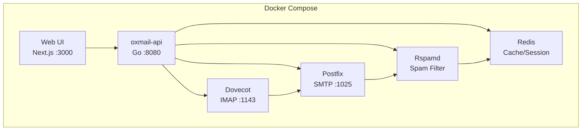

# Oxmail

**A beautiful, modern mail server you'll actually enjoy using.**

Oxmail wraps Postfix, Dovecot, and Rspamd into a single Docker Compose stack with a Go API and a dark-first Next.js dashboard. One command to start. Six containers. Under 1.5 GB of RAM.

## Features

- **Admin dashboard** ... manage domains, users, and aliases from a clean web UI
- **Webmail** ... read and send email right in the browser
- **Real-time logs** ... WebSocket-powered log streaming with filtering
- **CLI tool** ... `oxmail` command for scripting and quick admin tasks
- **Docker one-command setup** ... `docker compose up -d` and you're running
- **Dark-first UI** ... Linear/Vercel-inspired design with subtle cyber accents

## How Oxmail Compares

| | Oxmail | Mailcow | docker-mailserver | Mailu |
|---|---|---|---|---|
| RAM (idle) | ~1.2 GB | 4-6 GB | ~1 GB | ~1.5 GB |
| Containers | 6 | 15+ | 1 | 10+ |
| Web UI | Modern (Next.js) | Functional | None (CLI only) | Dated |
| Setup time | ~2 min | ~15 min | ~10 min | ~10 min |
| Admin API | REST + WebSocket | REST | CLI | REST |

## Quickstart

```bash
git clone https://github.com/MYusufEka/oxmail.git && cd oxmail
cp .env.example .env
docker compose up -d
```

Open [http://localhost:3000](http://localhost:3000) and log in with the admin password from your `.env` file.

For a detailed walkthrough with expected output at each step, see [docs/quickstart.md](docs/quickstart.md).

## Architecture



The Go API is the **config source of truth**. It generates Postfix and Dovecot configuration files from its internal state (SQLite). You never edit mail configs directly.

See [docs/architecture.md](docs/architecture.md) for the full data flow.

## Tech Stack

| Layer | Technology |
|-------|------------|
| Backend API | Go 1.22+, chi router, slog, SQLite |
| Frontend | Next.js 14+, TypeScript, shadcn/ui, Tailwind, TanStack Query |
| SMTP | Postfix |
| IMAP | Dovecot |
| Spam filtering | Rspamd |
| Cache/sessions | Redis |
| Containerization | Docker Compose |
| CLI | Go + Cobra |

## Configuration

All environment variables are prefixed with `OXMAIL_`. Copy `.env.example` to `.env` and adjust:

| Variable | Default | Description |
|----------|---------|-------------|
| `OXMAIL_MODE` | `dev` | `dev` or `production`. Dev mode uses local ports and relaxed auth. |
| `OXMAIL_DOMAIN` | `local.test` | Primary mail domain |
| `OXMAIL_ADMIN_PASSWORD` | `changeme123` | Admin password for first-run setup (min 8 chars) |
| `OXMAIL_API_PORT` | `8080` | API server port |
| `OXMAIL_WEB_PORT` | `3000` | Web UI port |
| `OXMAIL_SMTP_PORT` | `1025` | SMTP port (1025 dev, 25 production) |
| `OXMAIL_IMAP_PORT` | `1143` | IMAP port (1143 dev, 993 production) |
| `OXMAIL_PUBLIC_IP` | — | Public IP for SPF/rDNS (production only) |
| `OXMAIL_ACME_EMAIL` | — | Let's Encrypt email for TLS (production only) |
| `OXMAIL_REDIS_URL` | `redis://redis:6379` | Redis connection URL |

## Development

### Prerequisites

- Docker and Docker Compose
- Go 1.22+
- Node.js 18+
- Make

### Running locally

```bash
make dev        # Start full stack in dev mode (builds images + starts containers)
make logs       # Tail all container logs
make seed       # Seed test data (domain + users + emails)
make reset      # Wipe everything and re-seed
```

### Testing

```bash
make test       # Run all tests (Go + Vitest + Playwright)
make test-go    # Go unit/integration tests
make test-web   # Vitest frontend tests
make test-e2e   # Playwright E2E tests
```

### Linting

```bash
make lint       # golangci-lint + ESLint
```

## CLI Usage

The `oxmail` CLI talks to the API server for quick admin tasks:

```bash
# Domain management
oxmail domain add example.com
oxmail domain list

# User management
oxmail user add alice@example.com --password secret123
oxmail user list --domain example.com

# Alias management
oxmail alias add info@example.com alice@example.com
oxmail alias list --domain example.com

# Server health
oxmail status

# Log streaming
oxmail logs --follow

# Send a test email
oxmail send-test alice@example.com
```

Global flags: `--json` for machine-readable output, `--api-url` to target a different server.

## API

The REST API runs on port 8080. Key endpoints:

- `POST /api/auth/login` ... authenticate and get a JWT
- `GET /api/domains` ... list domains
- `POST /api/domains` ... create a domain
- `GET /api/users` ... list users
- `POST /api/users` ... create a user
- `GET /api/health` ... service health check
- `WS /api/logs/stream` ... real-time log streaming

Full specification: [`api-spec/openapi.yaml`](api-spec/openapi.yaml). See [docs/api.md](docs/api.md) for curl examples.

## Project Structure

```
cmd/oxmail-api/    Go API server
cmd/oxmail/        CLI tool (Cobra)
internal/          Go packages (api, domain, config, mail, logs)
web/               Next.js frontend (App Router, shadcn/ui)
docker/            Dockerfiles (postfix, dovecot, rspamd, api)
configs/           Config templates (.tmpl)
scripts/           Shell scripts (seed, healthcheck)
api-spec/          OpenAPI 3.1 specification
docs/              Documentation
tests/e2e/         Playwright E2E tests
```

## Contributing

1. Fork the repo and create a feature branch
2. Write tests first (TDD is the standard here)
3. Run `make lint` and `make test` before submitting
4. Keep commits atomic with clear messages
5. Open a PR against `main`

## License

[MIT](LICENSE) © 2026 MYusufEka
