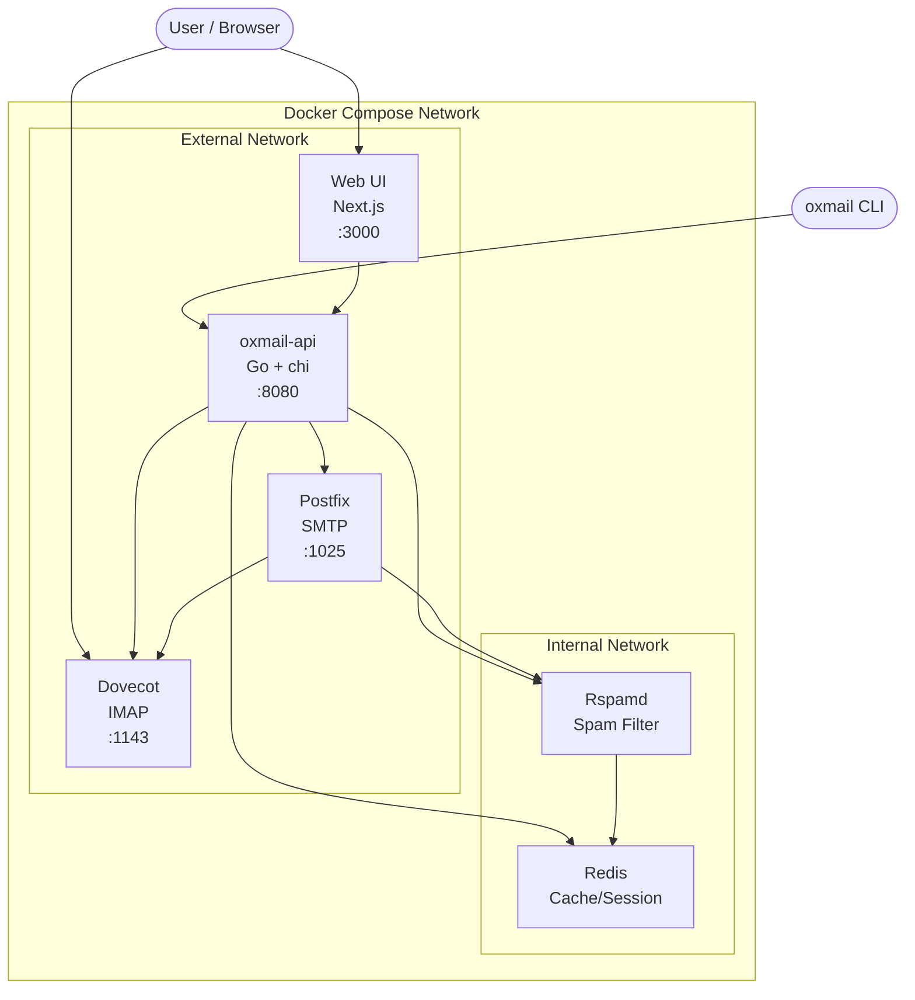

# Architecture

Oxmail is a dockerized mail server where a Go API acts as the control plane for Postfix, Dovecot, and Rspamd. The web UI and CLI both talk to the API. Nobody touches mail configs directly.

## System Diagram



## Components

### oxmail-api (Go)

The central control plane. Responsibilities:

- REST API for domain, user, and alias management
- JWT authentication
- Config generation: renders Postfix/Dovecot config files from templates
- WebSocket endpoint for real-time log streaming
- Health aggregation across all services
- SQLite for persistent state (domains, users, aliases, settings)

The API owns the config. When you add a domain or user through the UI or CLI, the API writes the change to SQLite, regenerates the relevant config templates, and signals Postfix/Dovecot to reload.

### Web UI (Next.js)

A Next.js App Router application with:

- Admin dashboard (domains, users, aliases, server health)
- Webmail interface (read/compose/send via the API)
- Real-time log viewer (WebSocket connection to the API)
- Command palette (Cmd+K) for quick navigation

The frontend never talks to Postfix or Dovecot directly. Everything goes through the API.

### Postfix (SMTP)

Handles inbound and outbound email delivery. Configured by the API via generated config files in the shared `config-data` volume.

- Receives mail on port 25 (exposed as 1025 in dev)
- Submission on port 587
- Passes incoming mail through Rspamd for spam checking
- Delivers to Dovecot via LMTP

### Dovecot (IMAP)

Stores and serves email to clients. Configured by the API.

- IMAP access on port 143 (exposed as 1143 in dev)
- Receives delivered mail from Postfix via LMTP
- Manages mailbox storage in the `mail-data` volume

### Rspamd (Spam Filter)

Scans inbound mail for spam, viruses, and phishing. Configured by the API.

- Milter integration with Postfix
- DKIM signing for outbound mail
- Uses Redis for statistics and rate limiting
- Bayes learning from user spam/ham actions

### Redis

Lightweight cache and session store.

- Rspamd statistics and rate limiting
- API session data
- Pub/sub for real-time log distribution

## Data Flow

### Inbound email

```
External MTA
    → Postfix (:25)
    → Rspamd (spam check)
    → Postfix (accepted)
    → Dovecot (LMTP delivery)
    → Mailbox on disk (mail-data volume)
```

### Outbound email

```
Web UI / CLI
    → API (compose endpoint)
    → Postfix (:587 submission)
    → Rspamd (DKIM signing)
    → External MTA
```

### Config change (add domain/user)

```
Web UI or CLI
    → API (REST call)
    → SQLite (persist change)
    → Template engine (render configs)
    → config-data volume (write files)
    → Postfix/Dovecot (reload signal)
```

### Log streaming

```
Postfix/Dovecot/Rspamd (syslog)
    → API (log collector)
    → Redis pub/sub
    → WebSocket → Web UI
    → WebSocket → CLI (oxmail logs --follow)
```

## Volumes

| Volume | Purpose | Used by |
|--------|---------|---------|
| `mail-data` | Mailbox storage (Maildir format) | Postfix, Dovecot, API |
| `config-data` | Generated config files | All mail services, API |
| `dkim-keys` | DKIM private/public keys | Postfix, API |
| `redis-data` | Redis persistence | Redis |
| `postfix-spool` | Postfix mail queue | Postfix, Dovecot |
| `rspamd-data` | Rspamd learned data | Rspamd |

## Networks

- **oxmail-internal**: Isolated network for inter-service communication. Redis and Rspamd live here exclusively.
- **oxmail-external**: Services that need to expose ports to the host (Web, API, Postfix, Dovecot).

## Resource Limits

| Container | Memory Limit |
|-----------|-------------|
| Redis | 64 MB |
| oxmail-api | 128 MB |
| Postfix | 256 MB |
| Dovecot | 256 MB |
| Web | 256 MB |
| Rspamd | 512 MB |
| **Total** | **~1.5 GB** |

## Key Design Decisions

1. **API as config source of truth.** Mail services don't manage their own config. The API generates everything from templates, making the system reproducible and auditable.

2. **SQLite over PostgreSQL.** One fewer container. The data model (domains, users, aliases) is simple and low-write. SQLite handles this comfortably.

3. **Wrap, don't replace.** Postfix and Dovecot are battle-tested. Oxmail configures them rather than reimplementing SMTP/IMAP.

4. **Two network zones.** Internal services (Redis, Rspamd) aren't exposed to the host. Only services that need external access get it.
